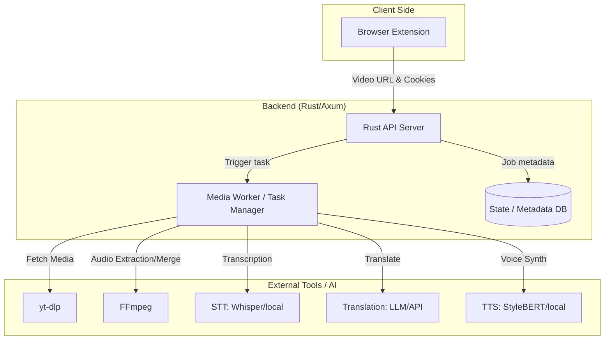

# Architecture Design: Video Dubbing Platform

## System Overview
多様な動画・音声サイトからコンテンツを取得し、日本語の吹き替え版を生成・視聴するためのシステム。

## Component Details

### 1. Rust API Server (Axum)
- **Roles**:
    - リクエスト受領 (URL, Cookie情報等)。
    - コンテンツ一覧の表示用メタデータの提供。
    - メディアファイルの配信。
- **Technologies**: `axum`, `tokio`, `sqlx` (SQLite or PostgreSQL), `serde`.

### 2. Media Worker (Tokio Async Tasks)
- **Roles**:
    - `yt-dlp` を使用した動画/音声のダウンロード（セッション維持のため Cookie 連携）。
    - `FFmpeg` を用いた音声分離・結合。
    - AI パイプラインのオーケストレーション。
- **Workflow**:
    1. **Download**: `yt-dlp --cookies-from-browser` (Extensionから渡されたCookieを使用)。
    2. **STT**: 元の音声をテキスト化。
    3. **Translate**: 日本語に翻訳。
    4. **TTS**: 翻訳後のテキストから日本語音声を生成。
    5. **Merge**: 元の映像（または静止画）と生成した日本語音声を合体。

### 3. Browser Extension (TypeScript)
- **Roles**:
    - 閲覧中のサイトから動画URLとセッションCookieを抽出。
    - APIに送信するインターフェース。

## Future Considerations
- **DRM**: 対象外。
- **Scaling**: Workerを別プロセスや分散処理に拡張可能な構成にする。
